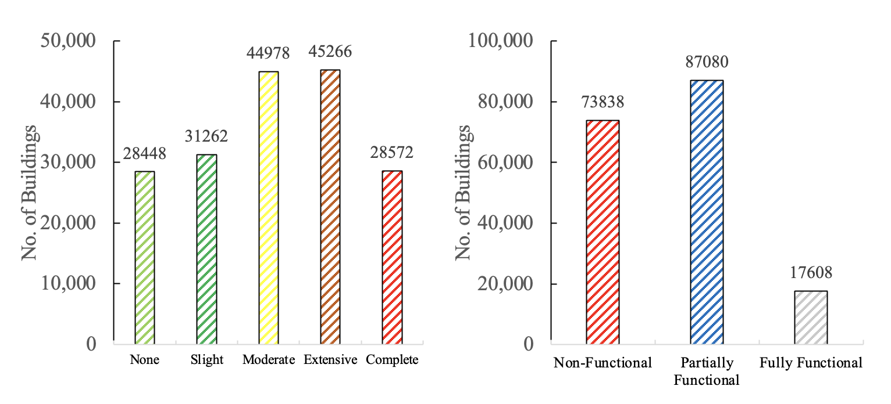
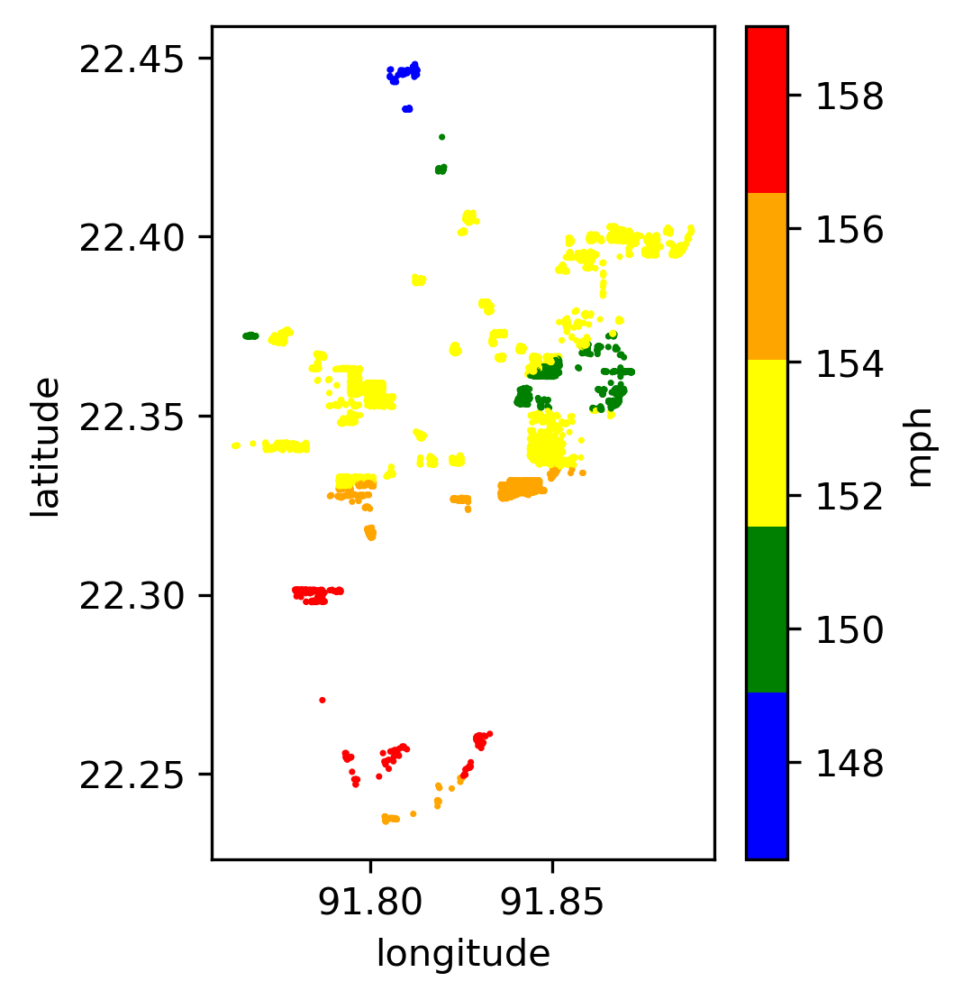
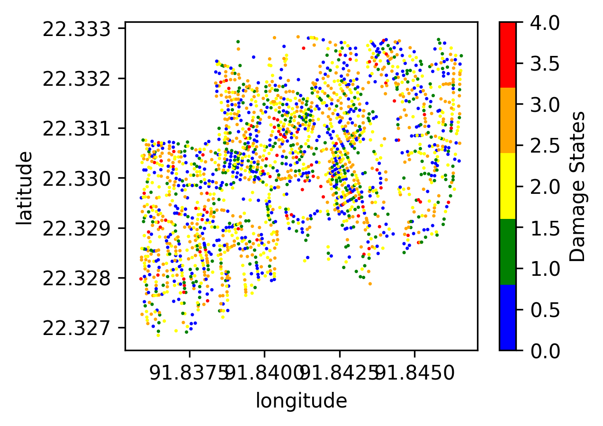
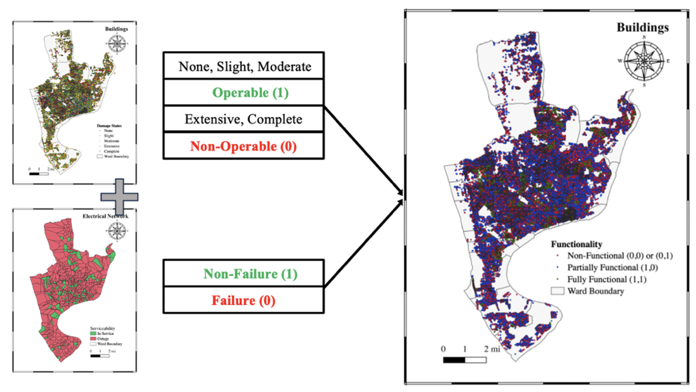

.. highlight:: shell

============
Illustrative Example
============

TCRA is a Python package designed to perform scenario-based tropical cyclone risk analysis. The software includes capability to:

1. Scenario-hazard estimation: peak gust wind speed at sites
2. Vulnerability analysis using fragility curves
3. Failure Probability Estimation: Monte Carlo Simulation
4. Loss Estimation: Damage Repair Cost
5. Recovery Simulations
6. Rahabilitation Scenario Simulation
7. Plotting Outputs on OpenStreetMap

Importing Necessary Dependencies
---------------------
.. code-block:: console

  import warnings
  import collections
  import concurrent.futures
  import folium
  import numpy as np
  import pandas as pd
  import matplotlib
  import matplotlib.pylab as plt
  import matplotlib.patches as mpatches
  from matplotlib.colors import ListedColormap
  from scipy.stats import expon, lognorm
  from scipy.spatial import distance
  from past.builtins import xrange
  import tcra
  from tcra.Cyclone import CycloneParameters
  from tcra.Vulnerability import FragilityAnalysis
  from tcra.DamageProbability import DamageProbabilityCalculator
  from tcra.Fragility import rehab_fragility_curves, fragility_curves_epn, fragility_curves
  from tcra.Plot import plot_scatter
  from tcra.Probplot import plot_lognormal_distribution
  from tcra.Interactive import plot_interactive_map
  from tcra.Recovery import rep, rep_EPN, recovery_monte_carlo_simulation
  from tcra.Cost import map_cost
  from tcra.DR import damage_ratio
  from typing import List

1. Hurricane Track Import, Building Data Import, Estimating Peak Velocity
---------------------

.. code-block:: console

  # Import Hurricane Historical Track
  track_df=pd.read_csv('InputTracks/Hur_91.csv')

  # Import Hurricane Historical Track
  track_df=pd.read_csv('91_Track1.csv')
  
  # this data includes time, lat, long and central pressure
  track_df.head(2)
  
  # Import Building Data
  blg=pd.read_csv('sample_buildings.csv')

  blg.head(2)

  # Inventory Size
  blg.shape

  # Plotting Structural Atchetypes Summary
  structuretype_counts=blg.type.value_counts()
  structuretype_counts.plot(kind='bar')
  plt.xlabel('Occupancy Type')
  plt.ylabel('%Buildings')
  plt.show()

  # Plotting Occupancy Types Summary
  occupancy_counts = blg.Occupancy.value_counts(normalize=True)
  occupancy_counts.plot(kind='bar')
  plt.xlabel('Occupancy Type')
  plt.ylabel('%Buildings')
  plt.show()

1.1. Scenario Hurricane - Wind Speed Simulation
---------------------

.. code-block:: console

  # Running wind hazard module to estimate Cyclone track characteristics and Wind Speeds
  # df_bdg_wind: database return with wind speed, VG: gust wind velocity
  cyclone_parameters = CycloneParameters(track_df)
  df_track = cyclone_parameters.estimate_parameters()
  df_bdg_wind, VG = cyclone_parameters.calculate_wind_speeds(df_track, blg)
  
  df_bdg_wind.head(2)
  df_bdg_wind.drop(['ind'], axis=1, inplace=True)

1.2. Plotting Peak Gust Wind Speed for All Buildings
---------------------

.. code-block:: console

  VG.plot.line(legend=None)
  plt.xlabel('Time Steps')
  plt.ylabel('Wind Speed(mph)')
  plt.show()

2. Vulnerability Analysis - Damage States Simulation
---------------------

.. code-block:: console

  # Assign random seed to reproduce random numbers
  seed=1234
  np.random.seed(seed)
  
  # Building invetory dataframe
  df_bdg_wind.head(2)
  
  building_data = df_bdg_wind
  
  # Defining Damage States - four damage states as per HAZUS (FEMA)
  DStates=['Slight','Moderate','Extensive', 'Complete']
  
  # Running Vulnerability Analysis based on Fragility Curves to assign Damage States to Structures
  fra= FragilityAnalysis(fragility_curves)
  Pr = fra.estimate_damage_state(building_data)
  damage_state = fra.sample_damage_state(Pr, DStates,seed)
  
  # Mapping Damage States [DStates] to Structures
  DamageStateMap = {None: 0, 'Slight': 1, 'Moderate': 2, 'Extensive': 3, 'Complete': 4}
  damage_state = damage_state.map(DamageStateMap)
  
  # Adding columns to estimate damage State Probabilities (LS: Limit State, DS: Damage State)
  DS_Prob=Pr
  DS_Prob['LS1'] = DS_Prob['Slight']
  DS_Prob['LS2'] = DS_Prob['Moderate']
  DS_Prob['LS3'] = DS_Prob['Extensive']
  DS_Prob['LS4'] = DS_Prob['Complete']
  DS_Prob['DS0'] = 1 - DS_Prob['Slight']
  DS_Prob['DS1'] = DS_Prob['Slight'] - DS_Prob['Moderate']
  DS_Prob['DS2'] = DS_Prob['Moderate'] - DS_Prob['Extensive']
  DS_Prob['DS3'] = DS_Prob['Extensive'] - DS_Prob['Complete']
  DS_Prob['DS4'] = DS_Prob['Complete']
  
  DS_Prob.head(2)
  
  # Merging Assigned Damage States (dmg) and DS probabilities to structure inventory
  s = pd.Series(damage_state,name='dmg')
  result_blg_damage= DS_Prob.join(s)
  
  result_blg_damage.head(2)
  
  # plotting wind speed
  plot_scatter(result_blg_damage, 'x', 'y', 'mph', save_path='wind_speed.png')
  
  # plotting damage states
  plot_scatter(result_blg_damage, 'x', 'y', 'dmg', save_path='blg_dmg_states_unrehab.png')

3. Failure Probability Estimation - Monte Carlo Simulation
-------------------------------

.. code-block:: console

  # Inventory results from Hazard and Vulnerability Analyses
  result_blg_damage.head(2)
  
  # Defining Damage Intervals and Failure State (i.e., DS3 and DS4 will considered failure)
  bldg_result=result_blg_damage 
  damage_interval_keys=['DS0', 'DS1', 'DS2', 'DS3', 'DS4']
  failure_state_keys=['DS3', 'DS4']
  num_samples=10
  
  # Estimating Failure Probabilites
  calculator = DamageProbabilityCalculator(failure_state_keys)
  dt, ki = calculator.sample_damage_interval(bldg_result, damage_interval_keys, num_samples, seed)
  
  # covert result to dataframe
  df_bldg = pd.DataFrame({'id': ki,'pf': dt})

  df_bldg.head(2)
  
  # Merging failure probability to structural inventory data
  result_bldg=pd.merge(result_blg_damage, df_bldg, on='id')
  
  result_bldg.head(2)
  
  # plotting damage failure probability
  plot_scatter(result_bldg, 'x', 'y', 'pf', save_path='blg_Dmg.png')
  
  # Plotting fitted lognormal PDF & CDF of prob. of failure
  plot_lognormal_distribution(result_bldg)

4. Loss Estimation - Damage Repair Cost
---------------------

.. code-block:: console

  # Calculating replacement cost of individual building, UC: Unit Cost and RCost: Replacement Cost
  df_cost = map_cost(blg)
  
  df_cost.head(2)
  
  # Merging cost and damage outputs
  s = pd.Series(damage_state,name='dmg')
  df_cost_dmg= df_cost.join(s)
  
  # Generating Damage Ratio of each building
  Loss = damage_ratio(df_cost_dmg)
  
  # Estimating Physical Damage Repair Cost ($) for each building
  Loss['PhyLoss']=Loss['RCost']*Loss['DRatio']
  
  #### Estimated Loss due to Physical Damage in $USD
  TotalPhyLoss=Loss.PhyLoss.sum()
  TotalPhyLoss

5. Recovery Simulations
---------------------

.. code-block:: console

  # Simulating Recovery Time of Buildings
  recovery_time = rep(result_bldg)
  result_bldg['RT_bdg'] = list(recovery_time)
  
  bb = []
  tt = list(range(0, 1000, 5))
  for T in tt:
      bb.append(result_bldg[result_bldg.RT_bdg < T].shape[0])
  
  bb=pd.Series(bb)*100/result_bldg.shape[0]
  
  x = list(tt)
  y1 = list(bb)
  rec_bldg=pd.DataFrame({'T': x,'Rec': y1})
  
  plt.figure(figsize=(6, 4))
  plt.plot(x, y1, label='PhyRecovery: Single Simulation')
  plt.xlabel("Time (Days)")
  plt.ylabel("% Recovery")
  plt.legend()
  plt.xlim(0, 900)
  plt.show()

  # Recovery Analysis - Multiple Recovery Scenarios using Monte Carlo Simulation
  x, all_simulations, mean, minimum, maximum = recovery_monte_carlo_simulation(result_bldg, num_simulations=100)

  # Plotting all simulations results
  plt.figure(figsize=(6, 4))
  for simulation in all_simulations:
      plt.plot(x, simulation, color='lightgray', alpha=1)
  plt.plot(x, mean, color='blue', label='Mean Recovery')
  plt.xlabel("Time (Days)")
  plt.ylabel("% Recovery")
  plt.legend()
  plt.xlim(0, 900)
  plt.show()

6. Rahab Simulation
---------------------

.. code-block:: console

  # Building damage outcomes and probability of failures
  output_building=result_bldg
  
  # Repairing buildings that has pf>0.7
  output_building.pf[output_building.pf>0.7].shape[0]/output_building.pf.shape[0]
  
  # Updating Building Type for buildings prioritized for repair, 'type_R', _R represets rehab
  df=output_building
  df['ntype'] = df.apply(lambda row: f"{row['type']}{'_R'}" if row['pf'] >0.4 else row['type'], axis=1)
  
  df=df.drop(columns=['type'])
  df.rename(columns={'ntype': 'type'}, inplace=True)
  
  # rehab factor and updating fragility curves accordingly
  rehab_factor = 1.5
  fragility_curves_rehab = rehab_fragility_curves(rehab_factor)

  DStates=['Slight','Moderate','Extensive', 'Complete']
  fra= FragilityAnalysis(fragility_curves_rehab)
  Pr_rehab = fra.estimate_damage_state(df)
  damage_state_rehab = fra.sample_damage_state(Pr_rehab, DStates,101)
  DamageStateMap = {None:0, 'Slight': 1, 'Moderate': 2, 'Extensive':3, 'Complete': 4}
  
  damage_state_rehab=damage_state_rehab.map(DamageStateMap)
  DS_Prob=Pr_rehab
  DS_Prob['LS1'] = DS_Prob['Slight']
  DS_Prob['LS2'] = DS_Prob['Moderate']
  DS_Prob['LS3'] = DS_Prob['Extensive']
  DS_Prob['LS4'] = DS_Prob['Complete']
  DS_Prob['DS0'] = 1 - DS_Prob['Slight']
  DS_Prob['DS1'] = DS_Prob['Slight'] - DS_Prob['Moderate']
  DS_Prob['DS2'] = DS_Prob['Moderate'] - DS_Prob['Extensive']
  DS_Prob['DS3'] = DS_Prob['Extensive'] - DS_Prob['Complete']
  DS_Prob['DS4'] = DS_Prob['Complete']
  s = pd.Series(damage_state_rehab,name='dmg')
  blg_dmg_rehab= DS_Prob.join(s)
  
  ## Cost Info
  new_blg_dmg_rehab = blg_dmg_rehab[['id', 'dmg']]
  blg_dmg_rehab=pd.merge(df_cost, new_blg_dmg_rehab, on='id')

  # new damage states of buildings after rehab
  blg_dmg_rehab.head(2)
  
  # estimating physical replacement cost after applying rehab
  result_p = damage_ratio(blg_dmg_rehab)
  result_p['PhyLoss']=result_p['RCost']*result_p['DRatio']
  TotalLoss=result_p.PhyLoss.sum()
  TotalLoss

7. Plotting Outputs Interactively - Damage States
---------------------

.. code-block:: console

  # Plot Damage
  node=blg_dmg_rehab.loc[0:,'x': 'y']
  node_dmg=blg_dmg_rehab.loc[0:,'dmg']
  
  plot_interactive_map(node, node_dmg, node_size=3, node_cmap_bins='cut', node_cmap=None, link_cmap=None)

.. raw:: html
    
    

        <iframe src="_static/interactive_plot.html" frameborder="0" style="position: absolute; top: 0; left: 0; width: 100%; height: 100%;"></iframe>
    

Functionality Results
-------------------------------

Social Impacts
-------------------------------

