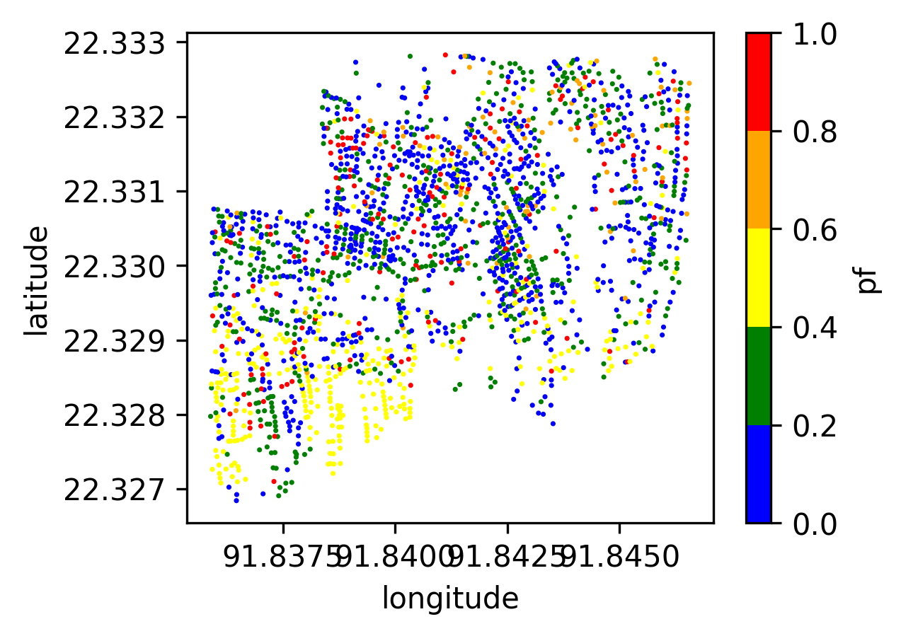
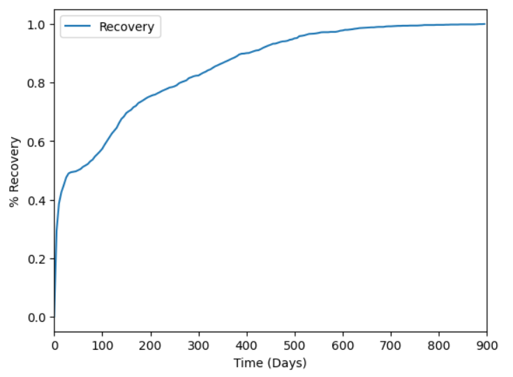
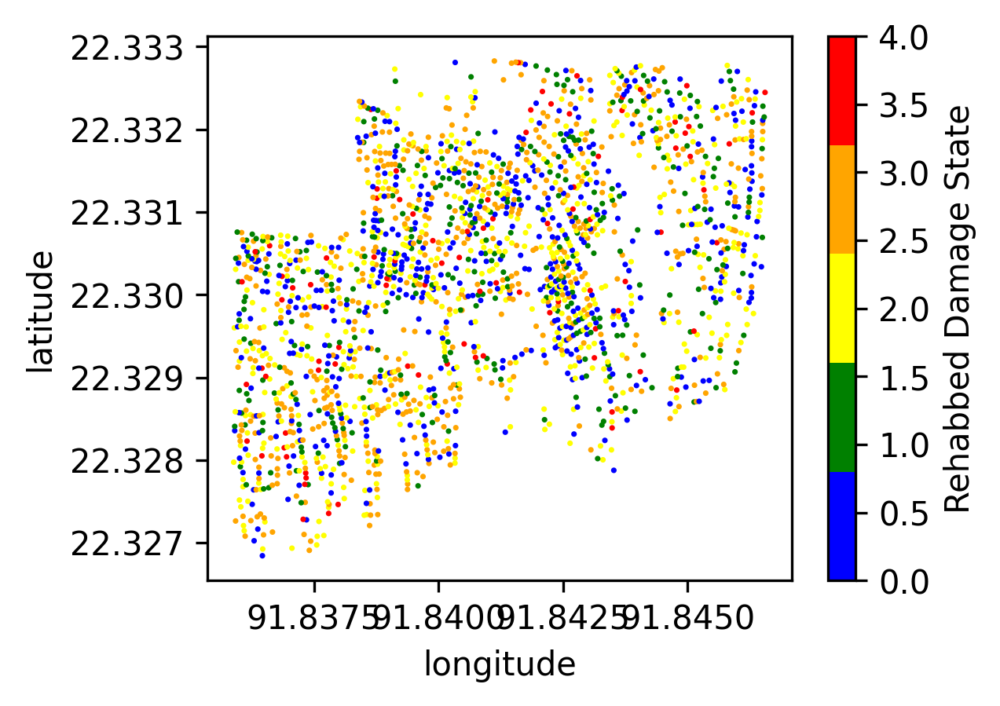
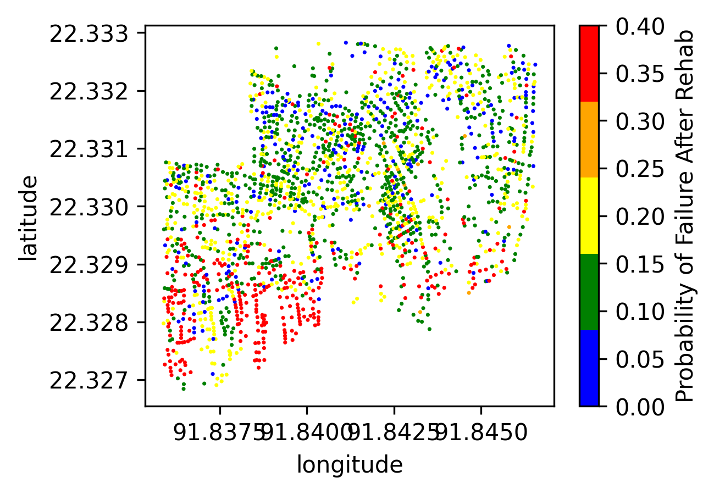

.. highlight:: shell

============
Illustrative Example
============

TCRA is a Python package designed to perform scenario-based tropical cyclone risk analysis. The software includes capability to:

1. Scenario-hazard estimation: peak gust wind speed at sites
2. Vulnerability analysis using fragility curves
3. Damage Simulation using peak gust wind and fragility curves of structures
4. Monte Carlo Simulation is performed for estimating probability of failure
5. Interactive outputs plotting on openstreetmap

.. code-block:: console

  import warnings
  import numpy as np
  import pandas as pd
  import matplotlib
  import matplotlib.pylab as plt
  from matplotlib.colors import ListedColormap
  from scipy.stats import expon, lognorm
  
  import tcra
  from tcra.Hurricane import HurricaneParameters
  from tcra.fragility_curves import fragility_curves
  from tcra.fragility_curves_epn import fragility_curves_epn
  from tcra.DamageAnalysis import FragilityAnalysis
  from tcra.MonteCarloSimulation import DamageProbabilityCalculator
  from tcra.fragility_rehab import rehab_fragility_curves
  from tcra.Plot import plot_scatter
  from tcra.Interactive import plot_interactive_map

Damage Simulation
-------------------

1. Hurricane Track Import, Building Data Import, Estimating Peak Velocity
---------------------

.. code-block:: console

  # Import Hurricane Historical Track
  track_df=pd.read_csv('InputTracks/Hur_91.csv')
  
  # this data includes time, lat, long and central pressure
  track_df.head(2)
  
  # Import Building Data
  blg=pd.read_csv('Buildings_Ctg2.csv')

  blg.head(2)

2. Scenario Hurricane - Wind Speed Simulation
---------------------

.. code-block:: console

  hurricane_parameters = HurricaneParameters(track_df)
  df_track = hurricane_parameters.estimate_parameters()
  df_bdg_wind, VG = hurricane_parameters.calculate_wind_speeds(df_track, blg)
  df_bdg_wind.head(2)
  df_bdg_wind.shape
  df_bdg_wind.head(2)
  df_bdg_wind.drop(['ind'], axis=1, inplace=True)

3. Plotting Peak Gust Wind Speed for All Buildings
---------------------

.. code-block:: console

  VG.plot.line(legend=None)
  plt.xlabel('Time Steps')
  plt.ylabel('Wind Speed(mph)')
  plt.show()
  # plt.savefig('Cyclone_Hazard.png', dpi=300)

4. Damage Simulation
---------------------

.. code-block:: console

  from tcra.fragility_curves import fragility_curves
  DStates=['Slight','Moderate','Extensive', 'Complete']
  
  # Example usage
  fra= FragilityAnalysis(fragility_curves)
  Pr = fra.estimate_damage(building_data)
  damage_state = fra.sample_damage_state(Pr, DStates)
  
  # Mapping damage states
  DamageStateMap = {None: 0, 'Slight': 1, 'Moderate': 2, 'Extensive': 3, 'Complete': 4}
  damage_state = damage_state.map(DamageStateMap)
  
  DS_Prob=Pr
  
  # Adding columns to the probability DataFrame
  DS_Prob['LS1'] = DS_Prob['Slight']
  DS_Prob['LS2'] = DS_Prob['Moderate']
  DS_Prob['LS3'] = DS_Prob['Extensive']
  DS_Prob['LS4'] = DS_Prob['Complete']
  DS_Prob['DS0'] = 1 - DS_Prob['Slight']
  DS_Prob['DS1'] = DS_Prob['Slight'] - DS_Prob['Moderate']
  DS_Prob['DS2'] = DS_Prob['Moderate'] - DS_Prob['Extensive']
  DS_Prob['DS3'] = DS_Prob['Extensive'] - DS_Prob['Complete']
  DS_Prob['DS4'] = DS_Prob['Complete']
  
  s = pd.Series(damage_state,name='dmg')
  result_blg_damage= DS_Prob.join(s)
  
  result_blg_damage.head(2)

5. Summary Damage
-------------------------------
.. figure:: figures/damage.png
   :scale: 50%
   :alt: Logo

6. Plotting Wind Speed
---------------------

.. code-block:: console

  plot_scatter(result_blg_damage, 'x', 'y', 'mph', save_path='wind_speed.png')

.. figure:: figures/wind_speed.png
   :scale: 50%
   :alt: Logo

7. Plotting Damage State
---------------------

.. code-block:: console

  plot_scatter(result_blg_damage, 'x', 'y', 'dmg', save_path='blg_dmg_states_unrehab.png')

.. figure:: figures/blg_dmg_states_unrehab.png
   :scale: 40%
   :alt: Log

8. Monte-Carlo Simulation
---------------------

.. code-block:: console

  # Libraries
  import folium
  import matplotlib.patches as mpatches
  from scipy.spatial import distance
  import collections
  import concurrent.futures
  from past.builtins import xrange
  from typing import List

  # Simulation Result
  bldg_result=result_blg_damage 
  damage_interval_keys=['DS0', 'DS1', 'DS2', 'DS3', 'DS4']
  failure_state_keys=['DS3', 'DS4']
  num_samples=10
  seed=101
  calculator = DamageProbabilityCalculator(failure_state_keys)
  dt, ki = calculator.sample_damage_interval(bldg_result, damage_interval_keys, num_samples, seed)
  # covert result to dataframe
  df_bldg = pd.DataFrame({'id': ki,'pf': dt})

9. Plotting Building Failure Through MCS
---------------------

.. code-block:: console

  plot_scatter(result_bldg, 'x', 'y', 'pf', save_path='blg_Dmg.png')

10. Plotting Interactive Map of Damage
---------------------

.. code-block:: console

  # Plot Damage
  node=result_bldg.loc[0:,'x': 'y']
  node_dmg=result_bldg.loc[0:,'dmg']
  #plot damage map
  plot_interactive_map(node, node_dmg, node_size=5, node_cmap_bins='cut', node_cmap=None, link_cmap=None)

.. raw:: html
    
    

        <iframe src="figures/interactive_plot.html" frameborder="0" style="position: absolute; top: 0; left: 0; width: 100%; height: 100%;"></iframe>
    

11. Plotting Interactive Map of Probability Failure
-------------------

.. code-block:: console

  # Plot Failure Probability
  node_pf=result_bldg.loc[0:,'pf']
  plot_interactive_map(node, node_pf, node_size=5, node_cmap_bins='cut', node_cmap=None, link_cmap=None)

.. raw:: html
    
    

        <iframe src="figures/interactive_map_pf.html" frameborder="0" style="position: absolute; top: 0; left: 0; width: 100%; height: 100%;"></iframe>
    

Recovery Simulation
-------------------

1. Recovery Time
-------------------------------

.. code-block:: console

  # Recovery Time
  recovery_time = rep(result_bldg, 100)
  result_bldg['RT'] = list(recovery_time)
  bb = []
  tt = list(range(0, 900, 5))
  for T in tt:
    bb.append(result_bldg[result_bldg.RT < T].shape[0])

  result_bldg.RT.min(), round(result_bldg.RT.mean(),2), round(result_bldg.RT.max(),2)
  bb=pd.Series(bb)/result_bldg.shape[0]

2. Plotting Recovery Time
-------------------------------

.. code-block:: console

  x = list(tt)
  y1 = list(bb)

  plt.plot(x, y1, label='Recovery')
  plt.xlabel("Time (Days)")
  plt.ylabel("% Recovery")
  plt.legend()
  plt.xlim(0, 900)

  plt.show()
  plt.savefig('Buildings_Recovery.png', dpi=600, bbox_inches='tight')

3. Preparing Dataframe for Rehab Simulation
-------------------------------

.. code-block:: console

  # Result of Damage and MCS
  output_building=result_bldg
  #Mean and Std of Pf
  output_building.pf.mean(), output_building.pf.std()
  df=output_building
  df['ntype'] = df.apply(lambda row: f"{row['type']}{'_R'}" if row['pf'] >0.5 else row['type'], axis=1)
  df= df.drop(columns=['type'])
  df.rename(columns={'ntype': 'type'}, inplace=True)

3. 50% Rehab Simulation
-------------------------------

.. code-block:: console

  rr_value = 1.5  # This can be any dynamic value you need
  fragility_curves_rehab = rehab_fragility_curves(rr_value)

  DStates=['Slight','Moderate','Extensive', 'Complete']
  fra= FragilityAnalysis(fragility_curves_rehab)
  Pr_rehab = fra.estimate_damage(df)
  damage_state_rehab = fra.sample_damage_state(Pr, DStates)
  
  # Damage State Mapping
  DamageStateMap = {None:0, 'Slight': 1, 'Moderate': 2, 'Extensive':3, 'Complete': 4}
  damage_state_rehab=damage_state_rehab.map(DamageStateMap)
  DS_Prob=Pr_rehab
  
  # Adding columns to the probability DataFrame
  DS_Prob['LS1'] = DS_Prob['Slight']
  DS_Prob['LS2'] = DS_Prob['Moderate']
  DS_Prob['LS3'] = DS_Prob['Extensive']
  DS_Prob['LS4'] = DS_Prob['Complete']
  DS_Prob['DS0'] = 1 - DS_Prob['Slight']
  DS_Prob['DS1'] = DS_Prob['Slight'] - DS_Prob['Moderate']
  DS_Prob['DS2'] = DS_Prob['Moderate'] - DS_Prob['Extensive']
  DS_Prob['DS3'] = DS_Prob['Extensive'] - DS_Prob['Complete']
  DS_Prob['DS4'] = DS_Prob['Complete']

  s = pd.Series(damage_state_rehab,name='dmg')
  blg_dmg_rehab= DS_Prob.join(s)

3. Redo Monte-Carlo Simulation
-------------------------------

.. code-block:: console

  bldg_result=blg_dmg_rehab
  damage_interval_keys=['DS0', 'DS1', 'DS2', 'DS3', 'DS4']
  failure_state_keys=['DS3', 'DS4']
  num_samples=10
  seed=101

  calculator = DamageProbabilityCalculator(failure_state_keys)
  dt_rehab, ki_rehab = calculator.sample_damage_interval(bldg_result, damage_interval_keys, num_samples, seed)

  blg_pf_rehab = pd.DataFrame({'id': ki_rehab,'pf': dt_rehab})
  result_rehab=pd.merge(blg_dmg_rehab, blg_pf_rehab, on='id')

4. Plotting Rehabbed Buildings Damage State
-------------------------------

.. code-block:: console

  plot_scatter(result_rehab, 'x', 'y', 'dmg', save_path='blg_rehab_dmg.png')

5. Plotting Rehabbed Buildings Failure Probability
-------------------------------

.. code-block:: console

  plot_scatter(result_rehab, 'x', 'y', 'pf', save_path='blg_rehab_pf.png')

Functionality Results
-------------------------------
.. figure:: figures/functionality.png
   :scale: 50%
   :alt: Logo
