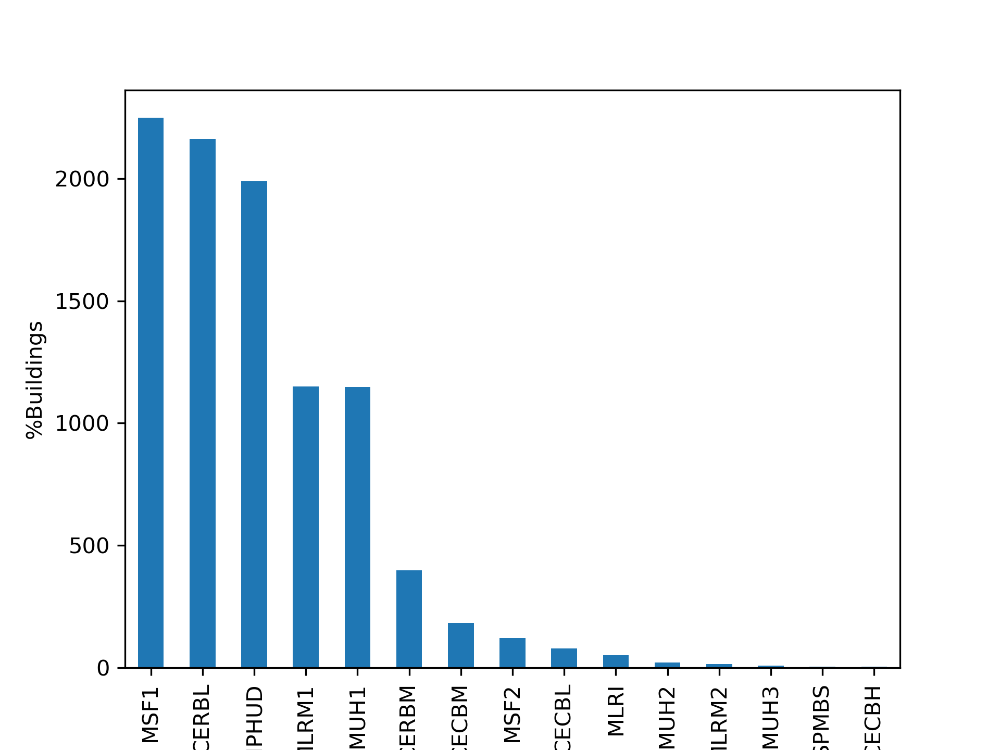
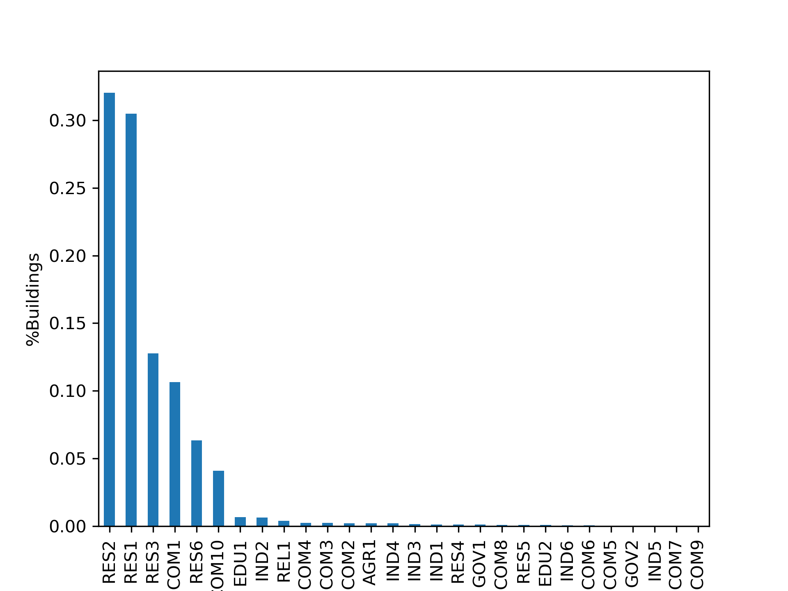
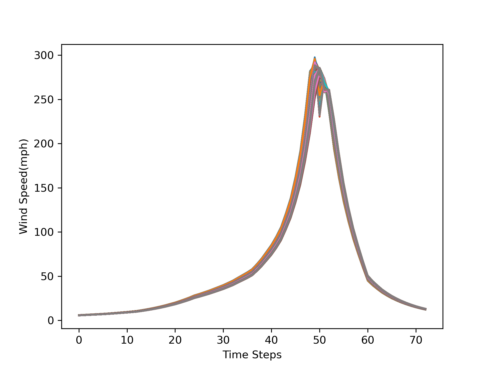
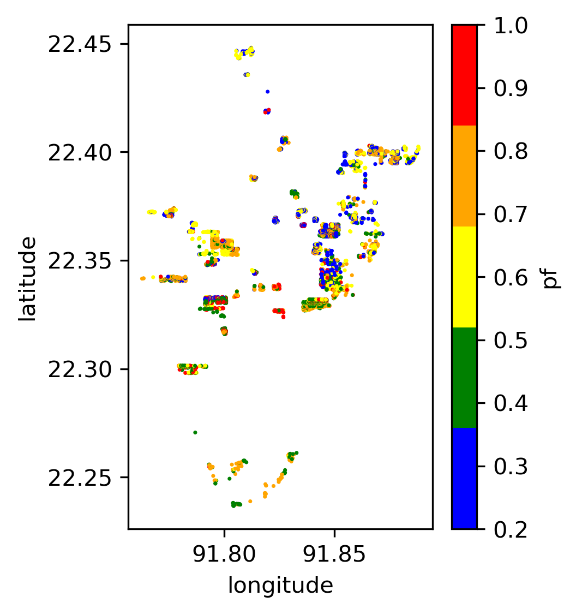
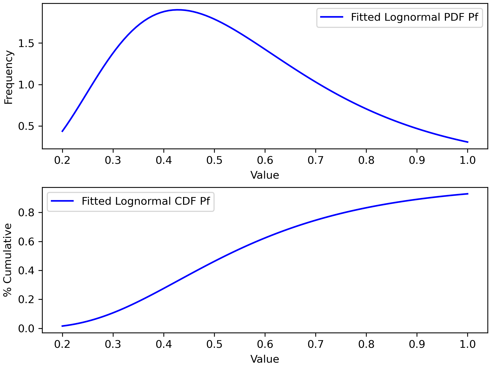
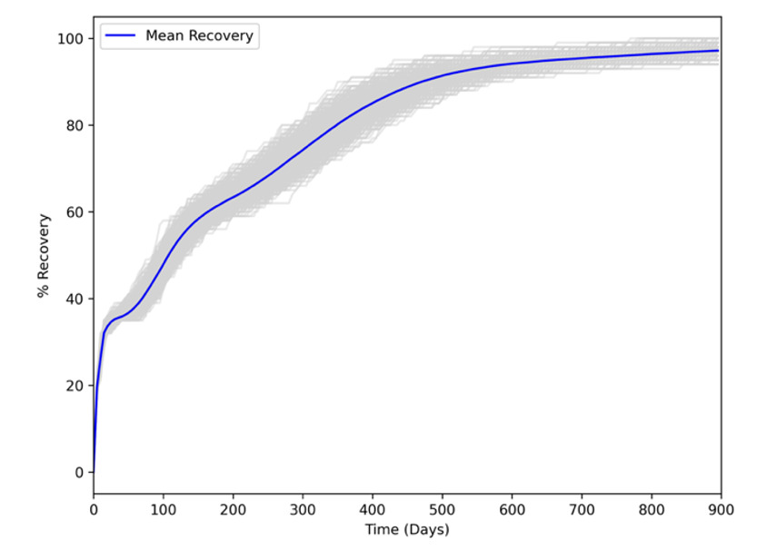
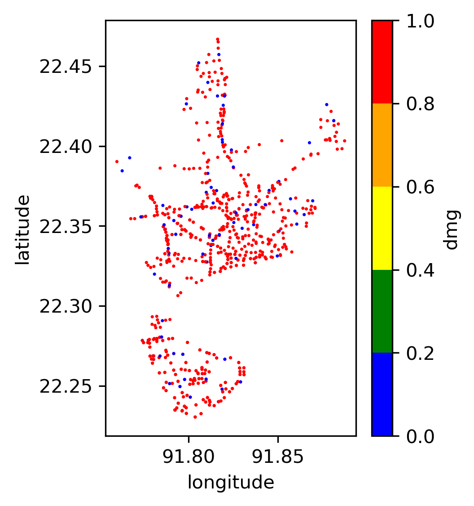

.. highlight:: shell

============
Illustrative Example
============

TCRA is a Python package designed to perform scenario-based tropical cyclone risk analysis. The software includes capability to:

1. Scenario-hazard estimation: peak gust wind speed at sites
2. Vulnerability analysis using fragility curves
3. Failure Probability Estimation: Monte Carlo Simulation
4. Loss Estimation: Damage Repair Cost
5. Recovery Simulations
6. Rahabilitation Scenario Simulation
7. Plotting Outputs on OpenStreetMap
8. Social Impact Analysis
9. EPN Damage Analysis 
10. Functionality Analysis

Importing Dependencies
---------------------
.. code-block:: console

  import warnings
  import collections
  import concurrent.futures
  import folium
  import numpy as np
  import pandas as pd
  import matplotlib
  import matplotlib.pylab as plt
  import matplotlib.patches as mpatches
  from matplotlib.colors import ListedColormap
  from scipy.stats import expon, lognorm
  from scipy.spatial import distance
  from past.builtins import xrange
  import tcra
  from tcra.Cyclone import CycloneParameters
  from tcra.Vulnerability import FragilityAnalysis
  from tcra.DamageProbability import DamageProbabilityCalculator
  from tcra.Fragility import rehab_fragility_curves, fragility_curves_epn, fragility_curves
  from tcra.Plot import plot_scatter
  from tcra.Probplot import plot_lognormal_distribution
  from tcra.Interactive import plot_interactive_map
  from tcra.Recovery import rep, rep_EPN, recovery_monte_carlo_simulation
  from tcra.Cost import map_cost
  from tcra.SocialAnalysis import categorize_area, categorize_areas
  from tcra.Functionality import calculate_fs
  from tcra.DR import damage_ratio
  from typing import List

1. Hurricane Track Import, Building Data Import, Estimating Peak Velocity
---------------------

.. code-block:: console

  # Import Hurricane Historical Track
  track_df=pd.read_csv('InputTracks/Hur_91.csv')

  # Import Hurricane Historical Track
  track_df=pd.read_csv('91_Track1.csv')
  
  # this data includes time, lat, long and central pressure
  track_df.head(2)
  
  # Import Building Data
  blg=pd.read_csv('sample_buildings.csv')

  blg.head(2)

  # Inventory Size
  blg.shape

**Table:** Building Structural Archetypes.

   ==============================  ===================================================================================================================
   Code                            Description - Structure Type
   ==============================  ===================================================================================================================
   MSF1	                           Masonry single-family 1 story
   MSF2	                           Masonry single-family ≥ 2 stories
   MMUH1	                         Masonry multi-family 1 story
   MMUH2	                         Masonry multi-family 2 stories
   MMUH3	                         Masonry multi-family ≥ 3 stories
   MLRM1	                         Masonry LR Strip Mall up to 15 ft
   MLRM2	                         Masonry LR Strip Mall > 15 ft
   MLRI	                           Masonry LR Industrial/Warehouse/Factory Buildings
   CERBL	                         Concrete Engineered Residential LR
   CERBM	                         Concrete Engineered Residential MR
   CERBH	                         Concrete Engineered Residential HR
   CECBL	                         Concrete Engineered Commercial LR
   CECBM	                         Concrete Engineered Commercial MR 
   CECBH	                         Concrete Engineered Commercial, HR
   SPMBS	                         Steel Pre-Engineered Metal Small 
   MHPHUD	                         Manufactured Home Pre-Housing and Urban Development
   ==============================  ===================================================================================================================
 
**Note:** *LR: Low-Rise (1-2 Stories); MR: Mid-Rise (3-5 Stories); High-Rise (6+ Stories).*

.. code-block:: console

  # Plotting Structural Atchetypes Summary
  structuretype_counts=blg.type.value_counts()
  structuretype_counts.plot(kind='bar')
  plt.xlabel('Occupancy Type')
  plt.ylabel('%Buildings')
  plt.show()

**Figure**: Building Invetory - Structural Archetypes

.. code-block:: console

  # Plotting Occupancy Types Summary
  occupancy_counts = blg.Occupancy.value_counts(normalize=True)
  occupancy_counts.plot(kind='bar')
  plt.xlabel('Occupancy Type')
  plt.ylabel('%Buildings')
  plt.show()

**Table:** Building Occupancy Class.

   ==============================  ===================================================================================================================
   Code                            Description - Occupancy Class
   ==============================  ===================================================================================================================
   RES1	                           Single-family Dwelling
   RES2	                           Mobile Home
   RES3	                           Multi-family Dwelling
   RES4	                           Temporary Lodging
   RES5                            Institutional Dormitory
   RES6	                           Nursing Home
   COM1	                           Retail Trade
   COM2	                           Wholesale Trade
   COM3	                           Personal and Repair Services
   COM4	                           Professional/Technical/Business Services
   COM5	                           Banks/Financial Institutions
   COM6	                           Hospital
   COM7	                           Medical Office/Clinic
   COM8	                           Entertainment & Recreation
   COM9	                           Theaters
   COM10	                         Parking
   IND1	                           Heavy Industrial
   IND2	                           Light Industrial
   IND3	                           Food/Drugs/Chemicals
   IND4	                           Metals/Minerals Processing
   IND5	                           High Technology
   IND6	                           Construction
   AGR1	                           Agriculture
   REL1	                           Church/Membership Organization
   GOV1	                           General Services
   GOV2	                           Emergency Response
   EDU1	                           Schools/Libraries
   EDU2	                           Colleges/Universities
   ==============================  ===================================================================================================================

**Figure:** Building Invetory - Occupancy Types

1.1. Scenario Hurricane - Wind Speed Simulation
---------------------

.. code-block:: console

  # Running wind hazard module to estimate Cyclone track characteristics and Wind Speeds
  # df_bdg_wind: database return with wind speed, VG: gust wind velocity
  cyclone_parameters = CycloneParameters(track_df)
  df_track = cyclone_parameters.estimate_parameters()
  df_bdg_wind, VG = cyclone_parameters.calculate_wind_speeds(df_track, blg)
  
  df_bdg_wind.head(2)
  df_bdg_wind.drop(['ind'], axis=1, inplace=True)

1.2. Plotting Peak Gust Wind Speed for All Buildings
---------------------

.. code-block:: console

  VG.plot.line(legend=None)
  plt.xlabel('Time Steps')
  plt.ylabel('Wind Speed(mph)')
  plt.show()

**Figure**: Wind Speed during Cyclone.

2. Vulnerability Analysis - Damage States Simulation
---------------------

.. code-block:: console

  # Assign random seed to reproduce random numbers
  seed=1234
  np.random.seed(seed)
  
  # Building invetory dataframe
  df_bdg_wind.head(2)
  
  building_data = df_bdg_wind
  
  # Defining Damage States - four damage states as per HAZUS (FEMA)
  DStates=['Slight','Moderate','Extensive', 'Complete']
  
  # Running Vulnerability Analysis based on Fragility Curves to assign Damage States to Structures
  fra= FragilityAnalysis(fragility_curves)
  Pr = fra.estimate_damage_state(building_data)
  damage_state = fra.sample_damage_state(Pr, DStates,seed)
  
  # Defining damage states to dataframe
  ids, statuses = damage_state
  df_ds = pd.DataFrame({'id': ids, 'status': statuses})
  
  # Mapping Damage States [DStates] to Structures
  DamageStateMap = {None: 0, 'Slight': 1, 'Moderate': 2, 'Extensive': 3, 'Complete': 4}
  df_ds['dmg'] = df_ds['status'].map(DamageStateMap)
  
  # Adding columns to estimate damage State Probabilities (LS: Limit State, DS: Damage State)
  DS_Prob=Pr
  DS_Prob['LS1'] = DS_Prob['Slight']
  DS_Prob['LS2'] = DS_Prob['Moderate']
  DS_Prob['LS3'] = DS_Prob['Extensive']
  DS_Prob['LS4'] = DS_Prob['Complete']
  DS_Prob['DS0'] = 1 - DS_Prob['Slight']
  DS_Prob['DS1'] = DS_Prob['Slight'] - DS_Prob['Moderate']
  DS_Prob['DS2'] = DS_Prob['Moderate'] - DS_Prob['Extensive']
  DS_Prob['DS3'] = DS_Prob['Extensive'] - DS_Prob['Complete']
  DS_Prob['DS4'] = DS_Prob['Complete']
  
  DS_Prob.head(2)
  
  # Merging Assigned Damage States (dmg) and DS probabilities to structure inventory
  result_blg_damage=pd.merge(DS_Prob, df_ds, on='id')
  
  result_blg_damage.head(2)
  
  # plotting wind speed
  plot_scatter(result_blg_damage, 'x', 'y', 'mph',  colorbar_label='mph', save_path='wind_speed.png')

.. figure:: figures/wind_speed.png
   :scale: 30%
   :alt: Logo

**Figure**: Wind Speed Map.

.. code-block:: console

  # plotting damage states
  plot_scatter(result_blg_damage, 'x', 'y', 'dmg',  colorbar_label='dmg', save_path='blg_dmg_states_unrehab.png')

.. figure:: figures/blg_dmg_states_unrehab.png
   :scale: 30%
   :alt: Logo

**Figure**: Damage States Map.

3. Failure Probability Estimation - Monte Carlo Simulation
-------------------------------

.. code-block:: console

  # Inventory results from Hazard and Vulnerability Analyses
  result_blg_damage.head(2)
  
  # Defining Damage Intervals and Failure State (i.e., DS3 and DS4 will considered failure)
  bldg_result=result_blg_damage 
  damage_interval_keys=['DS0', 'DS1', 'DS2', 'DS3', 'DS4']
  failure_state_keys=['DS3', 'DS4']
  num_samples=10
  
  # Estimating Failure Probabilites
  calculator = DamageProbabilityCalculator(failure_state_keys)
  dt, ki = calculator.sample_damage_interval(bldg_result, damage_interval_keys, num_samples, seed)
  
  # covert result to dataframe
  df_bldg = pd.DataFrame({'id': ki,'pf': dt})

  df_bldg.head(2)
  
  # Merging failure probability to structural inventory data
  result_bldg_pf=pd.merge(result_blg_damage, df_bldg, on='id')
  
  result_bldg_pf.head(2)
  
  # plotting damage failure probability
  plot_scatter(result_bldg_pf, 'x', 'y', 'pf',  colorbar_label='pf', save_path='pf.png')

**Figure**: Probability of Failure (pf) map.

.. code-block:: console

  # Plotting fitted lognormal PDF & CDF of prob. of failure
  plot_lognormal_distribution(result_bldg_pf)

**Figure**: Lognormal Distribution of Probability of Failure.

4. Loss Estimation - Damage Repair Cost
---------------------

.. code-block:: console

  # Calculating replacement cost of individual building, UC: Unit Cost and RCost: Replacement Cost
  df_cost = map_cost(blg)
  
  df_cost.head(2)
  
  # Merging cost and damage outputs
  df_cost_dmg=pd.merge(df_cost, df_ds, on='id')
  
  # Generating Damage Ratio of each building
  Loss = damage_ratio(df_cost_dmg)
  
  # Estimating Physical Damage Repair Cost ($) for each building
  Loss['PhyLoss']=Loss['RCost']*Loss['DRatio']
  
  # Project Loss due to Physical Damage in $USD
  TotalLoss=Loss.PhyLoss.sum()
  TotalPhyLoss=Loss.PhyLoss.sum()
  print(f"{TotalLoss / 1000000:.1f} Million USD")

5. Recovery Simulations
---------------------

.. code-block:: console

  # Building inventory with damage state
  building_dmg= pd.merge(blg, df_ds, on='id')
  result_blg_dmg=building_dmg

  # Simulating Recovery Time of Buildings
  recovery_time = rep(result_blg_dmg)
  result_blg_dmg['RT_bdg'] = list(recovery_time)
  
  bb = []
  tt = list(range(0, 1000, 5))
  for T in tt:
      bb.append(result_blg_dmg[result_blg_dmg.RT_bdg < T].shape[0])
  
  bb=pd.Series(bb)*100/result_blg_dmg.shape[0] 

  x = list(tt)
  y1 = list(bb)
  rec_bldg=pd.DataFrame({'T': x,'Rec': y1})
  
  plt.figure(figsize=(6, 4))
  plt.plot(x, y1, label='PhyRecovery: Single Simulation')
  plt.xlabel("Time (Days)")
  plt.ylabel("% Recovery")
  plt.legend()
  plt.xlim(0, 900)
  plt.show()

  # Recovery Analysis - Multiple Recovery Scenarios using Monte Carlo Simulation
  x, all_simulations, mean, minimum, maximum = recovery_monte_carlo_simulation(result_blg_dmg, num_simulations=10)

  # Plotting all simulations results
  plt.figure(figsize=(6, 4))
  for simulation in all_simulations:
      plt.plot(x, simulation, color='lightgray', alpha=1)
  plt.plot(x, mean, color='blue', label='Mean Recovery')
  plt.xlabel("Time (Days)")
  plt.ylabel("% Recovery")
  plt.legend()
  plt.xlim(0, 900)
  plt.show()

**Figure**: Recovery.

6. Rahab Simulation
---------------------

.. code-block:: console

  # Building damage outcomes and probability of failures
  output_building=result_bldg_pf

  # Repairing buildings that has pf>0.7
  output_building.pf[output_building.pf>0.7].shape[0]/output_building.pf.shape[0]
    
  # Updating Building Type for buildings prioritized for repair, 'type_R', _R represets rehab
  df=output_building
  df['ntype'] = df.apply(lambda row: f"{row['type']}{'_R'}" if row['pf'] >0.4 else row['type'], axis=1)
    
  df=df.drop(columns=['type'])
  df.rename(columns={'ntype': 'type'}, inplace=True)
  
  # rehab factor and updating fragility curves accordingly
  rehab_factor = 1.3
  fragility_curves_rehab = rehab_fragility_curves(rehab_factor)
  
  DStates=['Slight','Moderate','Extensive', 'Complete']
  fra= FragilityAnalysis(fragility_curves_rehab)
  Pr_rehab = fra.estimate_damage_state(df)
  damage_state_rehab = fra.sample_damage_state(Pr_rehab, DStates,seed)
  ids, statuses = damage_state_rehab
  df_ds = pd.DataFrame({'id': ids, 'status': statuses})
  DamageStateMap = {None: 0, 'Slight': 1, 'Moderate': 2, 'Extensive': 3, 'Complete': 4}
  df_ds['dmg'] = df_ds['status'].map(DamageStateMap)
  
  DS_Prob=Pr_rehab
  DS_Prob['LS1'] = DS_Prob['Slight']
  DS_Prob['LS2'] = DS_Prob['Moderate']
  DS_Prob['LS3'] = DS_Prob['Extensive']
  DS_Prob['LS4'] = DS_Prob['Complete']
  DS_Prob['DS0'] = 1 - DS_Prob['Slight']
  DS_Prob['DS1'] = DS_Prob['Slight'] - DS_Prob['Moderate']
  DS_Prob['DS2'] = DS_Prob['Moderate'] - DS_Prob['Extensive']
  DS_Prob['DS3'] = DS_Prob['Extensive'] - DS_Prob['Complete']
  DS_Prob['DS4'] = DS_Prob['Complete']
  blg_dmg_rehab=pd.merge(DS_Prob, df_ds, on='id')

  ## Cost Info
  new_blg_dmg_rehab = blg_dmg_rehab[['id', 'dmg']]
  blg_dmg_rehab=pd.merge(df_cost, new_blg_dmg_rehab, on='id')
    
  # new damage states of buildings after rehab
  blg_dmg_rehab.head(2)
  
  # Estimating physical replacement cost after applying rehab
  result_p = damage_ratio(blg_dmg_rehab)
  result_p['PhyLoss']=result_p['RCost']*result_p['DRatio']
  TotalLoss=result_p.PhyLoss.sum()
  print(f"{TotalLoss / 1000000:.1f} Million USD")

7. Plotting Interactive Outputs on Open Street Map - Damage States
---------------------

.. code-block:: console

  # Plot Damage
  node=blg_dmg_rehab.loc[0:,'x': 'y']
  node_dmg=blg_dmg_rehab.loc[0:,'dmg']
  
  plot_interactive_map(node, node_dmg, node_size=3, node_cmap_bins='cut', node_cmap=None, link_cmap=None)

.. raw:: html
    
    

        <iframe src="_static/interactive_plot.html" frameborder="0" style="position: absolute; top: 0; left: 0; width: 100%; height: 100%;"></iframe>
    

8. Social Impact Analysis
---------------------

.. code-block:: console

  # Building Data with 
  building_dmg.head(2)
  
  df=building_dmg
  df['unit'] = categorize_areas(df)
  df['hh_unit'] = df["Floor"] * df["unit"]
  
  # Assume buildings will be non-operable if DS>2 (i.e., extensive or complete)
  df=df[df.dmg>2]

  # Dislocated households
  residential_df = df[df['Occupancy'].isin(['RES1', 'RES2', 'RES3', 'RES4', 'RES5', 'RES6'])]
  educational_df = df[df['Occupancy'].isin(['EDU1', 'EDU2'])]
  government_df = df[df['Occupancy'].isin(['GOV1', 'GOV2'])]
  industrial_df = df[df['Occupancy'].isin(['IND1', 'IND2', 'IND3', 'IND4', 'IND5', 'IND6'])]
  
  print('Total residential buildings dislocated:', residential_df.shape[0])
  print('Total households dislocated:', residential_df.hh_unit.sum())
  print('Total education buildings damaged:', educational_df.shape[0])
  print('Total government buildings damaged:', government_df.shape[0])
  print('Total industrial buildings damaged:', industrial_df.shape[0])

9. Damage Analysis - Electrical Poles
---------------------

.. code-block:: console

  epn_data = pd.read_csv('pole.csv')
  epn_data.head()
  
  # Running wind hazard module to estimate Cyclone track characteristics and Wind Speeds
  # df_epn_wind: database return with wind speed, VG: gust wind velocity
  cyclone_parameters = CycloneParameters(track_df)
  df_track = cyclone_parameters.estimate_parameters()
  df_epn_wind, VG = cyclone_parameters.calculate_wind_speeds(df_track, epn_data)
    
  df_epn_wind.shape
  df_epn_wind.drop(['ind'], axis=1, inplace=True)
    
  # Assign random seed to reproduce random numbers
  seed=1234
  np.random.seed(seed)

  epn_data = df_epn_wind
  
  # Defining Damage States
  DStates=['Fail']

  # Running Vulnerability Analysis based on Fragility Curves to assign Damage States to Structures
  fra= FragilityAnalysis(fragility_curves_epn)
  Pr = fra.estimate_epn_damage_state(epn_data)
  epn_damage_state = fra.sample_damage_state(Pr, DStates,seed)

  ids, statuses = epn_damage_state
  df_epn_ds = pd.DataFrame({'id': ids, 'status': statuses})

  # Mapping Damage States [DStates] to Structures
  DamageStateMap = {None: 0, 'Fail': 1}
  df_epn_ds['dmg'] = df_epn_ds['status'].map(DamageStateMap)
  
  # Adding columns to estimate damage State Probabilities (LS: Limit State, DS: Damage State)
  DS_Prob=Pr
  DS_Prob['LS1'] = DS_Prob['Fail']
  DS_Prob['DS0'] = 1 - DS_Prob['Fail']
  DS_Prob['DS1'] = DS_Prob['Fail']
  
  # Merging Assigned Damage States (dmg) and DS probabilities to structure inventory
  result_epn_damage= pd.merge(DS_Prob, df_epn_ds, on='id')
    
  # plotting damage state maps
  plot_scatter(result_epn_damage, 'x', 'y', 'dmg',  colorbar_label='dmg', save_path='dsm_epn.png')

  # Plot Damage
  node=result_epn_damage.loc[0:,'x': 'y']
  node_dmg=result_epn_damage.loc[0:,'dmg']
  m_epn=plot_interactive_map(node, node_dmg, node_size=3, node_cmap_bins='cut', node_cmap=None, link_cmap=None)
  m_epn

**Figure**: Electrical Poles Damage States.

10. Functionality Analysis - Connecting Building & EPN Performance
---------------------

.. code-block:: console

  # Building Inventoy is mapped to corresponding dependent EPN pole through voronoi polygon
  # Voronoi polygon is a geospatial analysis to determine service area for each electrical outlet (i.e. poles)
  
  Here are steps for conducting Voronoi analysis in QGIS (this can be done using other tools):
  
  1. **Prepare Data:** load EPN layer and ensure it's in a projected coordinate system.
  2. **Open Processing Toolbox:** go to `Processing` > `Toolbox`.
  3. **Generate Voronoi Polygons:** search for `Voronoi polygons` in the toolbox, select EPN layer as input, specify output settings (study area boundary), and run the tool.
  4. **Connect Building to Voronoi Layer:** intersect building layer to voronoi layer to assign dependent voronoi service area and/or dependent electrical pole. 'vid' field in the building layer is obtained through this process and vid represents epn id, as well as voronoi id corresponds to a building

  # building inventory with voronoi and damage info
  building_dmg.head()
  
  # EPN data with damage state
  result_epn = result_epn_damage[['id', 'dmg']].rename(columns={'dmg': 'dmg_epn','id':'id_epn'})
  
  # Building Data - merging dmg to building invetory
  blg_epn_results = pd.merge(building_dmg, result_epn, left_on='vid', right_on='id_epn')
  
  blg_epn_results.head(2)
  
  # Calculate Functionality State: 'FS'
  df_func = calculate_fs(blg_epn_results, 'dmg', 'dmg_epn')
  
  # Functionality Results (0: No Functionality, 1: Partially Functional, 2: Fully Functional)
  df_func.FS.value_counts()
