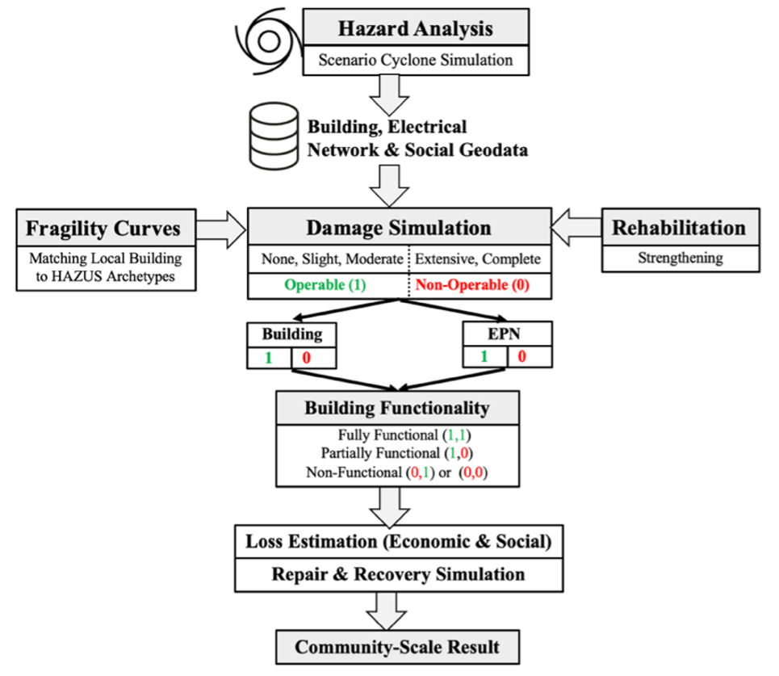

.. highlight:: shell

============
Framework
============

TCRA is a Python package designed to perform scenario-based tropical cyclone risk analysis. 

The software includes capability to:

   TCRA executes a Scenario-based Tropical Cyclone Risk Analysis Framework, as shown in Fig 1. This framework uses historical or simulated cyclone track to estimate wind intensity at buildings and electical pole sites over an extended period of hurricane. The scenario cyclone-hazard uses a wind field model that includes surface pressure field and a system translated speed. Vulnerability analysis is performed using existing fragility curves. Physical damage ratio and damage states are estimated through stochastic simulation. The outputs of buildings and electrical poles are combined to estimate functionality of buildings. Loss estimation is performed based on damage ratio and building replacement cost. Finally, this framework allows to prioritize buildings for rehabilitation by estimating probability of failure of buildings through Monte Carlo simulation. Pre-disaster rehabilitation is modelled by modifiying fragiluty curves. Main components of the framework include:

1. Scenario-hazard Estimation - peak gust wind speed at sites
2. Vulnerability Analysis - using fragility curves
3. Damage Simulation - using peak gust wind and fragility curves of structures
4. Prioritize Buildings for Recovery - Monte Carlo Simulation is performed for estimating probability of failure
5. Loss Estimation - using estimated physical damage ratio and building replacement cost
6. Social Impact Analysis - connecting physical damage to social components
7. Recovery Analysis - stochastic recovery simulation using FEMA guideline
8. Rehabilitation Scenario Analysis - estimated based on modified fragility curves and subsequent damage states, and recovery approach
6. Interactive Outputs Plotting on OpenStreetMap

Flow Chart: Tropical Cyclone Risk Analysis Framework
-------------------------------

**Fig 1.** Framework for Scenario-Cyclone Risk Analysis.
