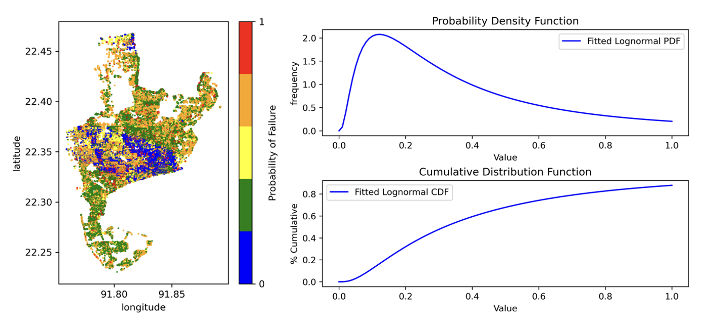

.. raw:: latex

    \newpage

Damage Probability Estimation
======================================
Monte Carlo Simulation is performed to estimate the probability of failure of buildings. In a single stochastic realization, damage state is simulted by comparing generated random number on uniform distribution [0,1], fragility curves and wind speed intensity. Through a Monte Carlo simulation, using the same hazard intensity, random number is generated multiple times (say, n-times) and then probability of failure is defined by the number of times structure sustain failure (for building damage states extensive (DS3) or complete (DS4)) out of multiple runs (n-times).

**Following is an example of damage probability estimation**::

    # Inventory results from Hazard and Vulnerability Analyses
    result_blg_damage.head(2)

    # Defining Damage Intervals and Failure State (i.e., DS3 and DS4 will considered failure)
    bldg_result=result_blg_damage 
    damage_interval_keys=['DS0', 'DS1', 'DS2', 'DS3', 'DS4']
    failure_state_keys=['DS3', 'DS4']
    num_samples=10

    # Estimating Failure Probabilites (dt: failure probability, ki: ids)
    calculator = DamageProbabilityCalculator(failure_state_keys)
    dt, ki = calculator.sample_damage_interval(bldg_result, damage_interval_keys, num_samples, seed)

    # covert result to dataframe
    df_bldg = pd.DataFrame({'id': ki,'pf': dt})
    
    # Merging failure probability to structural inventory data
    result_bldg_pf=pd.merge(result_blg_damage, df_bldg, on='id')

**Fitting Failure Probabilities to Lognormal Distribution and plotting PDF and CDF of lognormal dist**::

    # Plotting fitted lognormal PDF & CDF of prob. of failure
    plot_lognormal_distribution(result_bldg_pf)

**Fig 3.** Probability of Failure and Probability Density Function and Cumulative Distribution Function.
