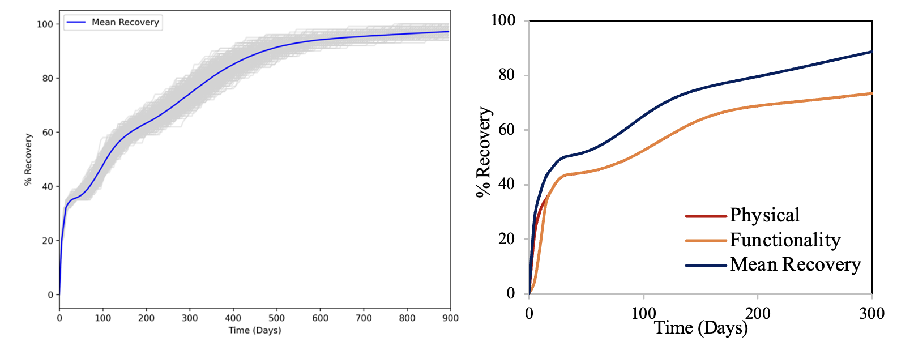

.. raw:: latex

    \newpage

Recovery Simulation
======================================

Recovery (repair time) is sumulated for damaged buildings based on the level of damaged sustained by the buildings, building occupancy type and recovery time recommended by FEMA. FEMA (2020) guideline provides expected mean repair time by building occupancy type for various damage states. To account the uncertainity in recovery time, a COV was assumed for correspond to mean recovery time. 

Following as an example of recovery simulation::

    # recovery of building, data: building invetory with damage state and occupancy type.
    df_recovery_time= rep(data)    
    recovery_outputs=recovery_monte_carlo_simulation(data, num_simulations)
    
    # recovery of electrical pole, data: epn invetory with failure state
    df_recovery_epn=rep_EPN(data)

**Fig 3.** Example Recovery Curves.
