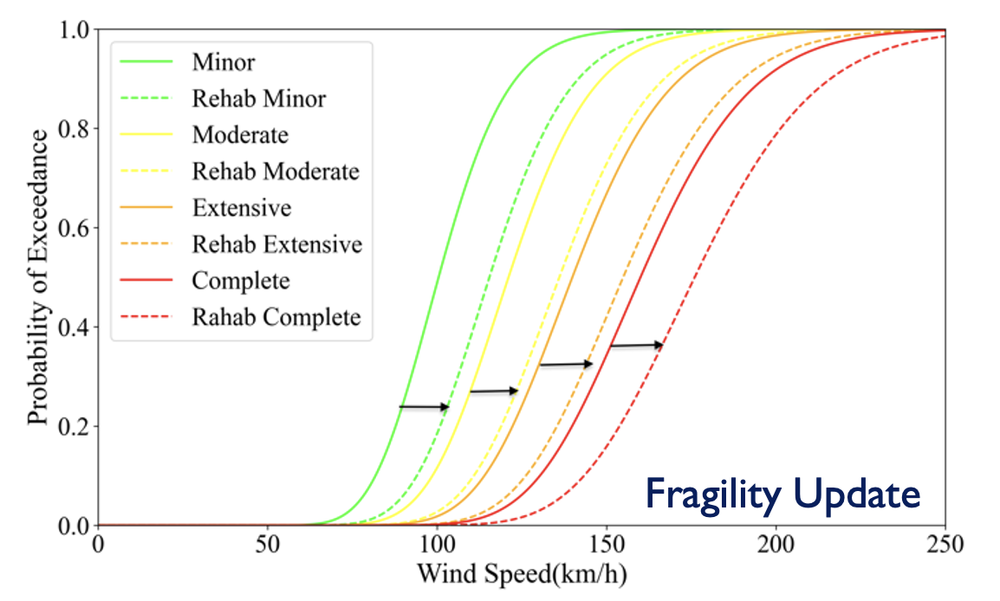

.. raw:: latex

    \newpage

Rehabilitation Scenarios
======================================

This module simulates rehabilitation scenarios by accounting for pre-disater building strengthing. To determine the performance of rehabbed buildings, associated fragility curves are adjusted. For instance, if a building is rehabilitate to improve 20% of performance, the meadian of the fragility curve is being shifted by 1.2 without changing the shape of the fragility curves. The rehabilitation is performed for buildings prioritized based on the probability of failure.

**Fig 3.** Example Fragility Curves Adjustment for Rehabilitation.

Following as an example of recovery simulation::

    # adjusting fragility curves, rr: repair and rehab amount; i.e, rr=1.5 for 50% of performance improve due to rehab 
    df_recovery_time= rehab_fragility_curves(rr)   
    
    # re-do the vulnerability analysis based on updated fragility
    df_recovery_epn=rep_EPN(data)
