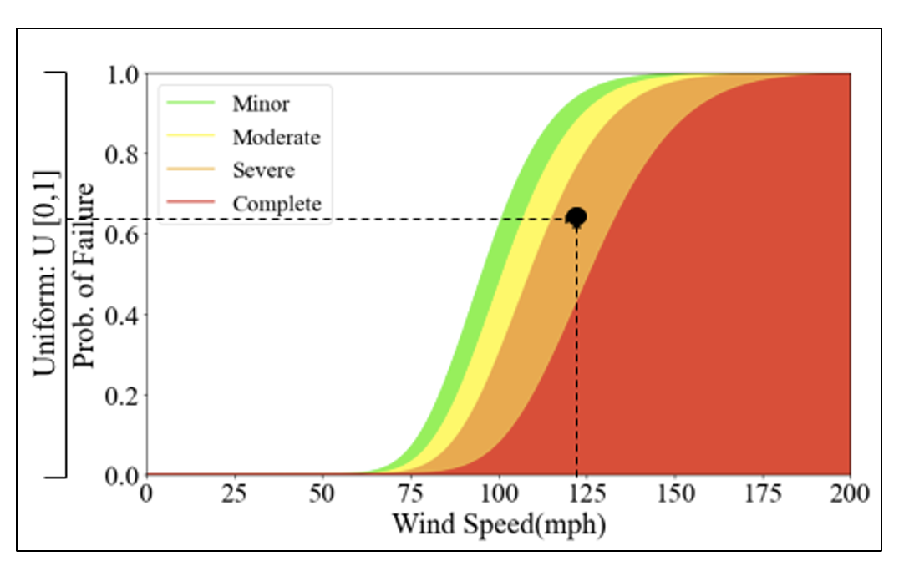

.. raw:: latex

    \newpage

Vulnerability Analysis
======================================
This module performs damage analysis of structure based on fragility curves and wind intensities estimated from Hazard module. Damage states can be defined limit states and available fragility curves. This study uses four damage states, namely slight, moderate, extensive, and complete, as defined in HAZUS (FEMA 2012) to represent the damage extent of a building against a scenario cyclone event. The probability of exceeding a damage state given an intensity (e.g., wind) is determined using fragility functions. To characterize uncertainties of a scenario event, the damage state of a building is estimated through a stochastic simulation. Damage state to an individual building/structure is assigned by generating random number U[0,1] on y-axis, and compare with wind intensity and probability of exceeding damage states. Fig. 2 shows an example of fragility curves, and damage state simulation by generating a random number. 

**Fig 2.** Stochastic Damage Simulation using Fragility Curves.

**Following is an example of running vulnerability module to estimate damage states**::

    # Building inventory
    building_data = df_bdg_wind

    # Define Damage States
    DStates=['Slight','Moderate','Extensive', 'Complete']

    fra= FragilityAnalysis(fragility_curves)
    Pr = fra.estimate_damage(building_data)
    damage_state = fra.sample_damage_state(Pr, DStates,seed)
  
    # simplifying damage state dataframe
    ids, statuses = damage_state
    df_ds = pd.DataFrame({'id': ids, 'status': statuses})

    # Mapping Damage States [DStates] to Structures
    DamageStateMap = {None: 0, 'Slight': 1, 'Moderate': 2, 'Extensive': 3, 'Complete': 4}
    df_ds['dmg'] = df_ds['status'].map(DamageStateMap)
